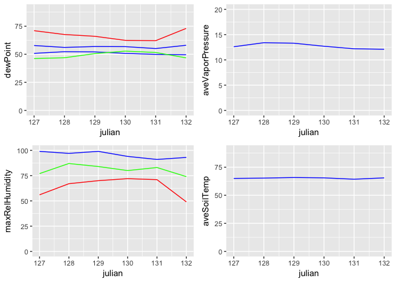

CIMIS.Rmd
================

R Markdown
----------

This is an R Markdown document. Markdown is a simple formatting syntax for authoring HTML, PDF, and MS Word documents. For more details on using R Markdown see <http://rmarkdown.rstudio.com>.

When you click the **Knit** button a document will be generated that includes both content as well as the output of any embedded R code chunks within the document. You can embed an R code chunk like this:

``` r
library(RCurl)
```

    ## Loading required package: bitops

``` r
# source.url <- c("https://raw.githubusercontent.com/cordphelps/gradient/master/climate/CIMIS/daily231.csv")
#nino <- read.csv(source.url, header=TRUE, row.names=NULL)

nino <- readRDS("/Users/rcphelps/code/thesis/climate/nino.rds")
library(skimr); 
skim(nino)
```

    ## Skim summary statistics
    ##  n obs: 6 
    ##  n variables: 31 
    ## 
    ## Variable type: factor 
    ##        variable missing complete n n_unique                     top_counts
    ##            date       0        6 6        6 5/1: 1, 5/1: 1, 5/1: 1, 5/7: 1
    ##  QCaveWindSpeed       0        6 6        3        R: 4,  : 1, Y: 1, NA: 0
    ##           QCETo       0        6 6        1                    N: 6, NA: 0
    ##      QCsolarRad       0        6 6        3        M: 3,  : 2, R: 1, NA: 0
    ##       QCwindRun       0        6 6        3        R: 4,  : 1, Y: 1, NA: 0
    ##          refETo       0        6 6        1                   --: 6, NA: 0
    ##        solarRad       0        6 6        4  --: 3, 337: 1, 588: 1, 803: 1
    ##  ordered
    ##    FALSE
    ##    FALSE
    ##    FALSE
    ##    FALSE
    ##    FALSE
    ##    FALSE
    ##    FALSE
    ## 
    ## Variable type: integer 
    ##        variable missing complete n   mean   sd  p0    p25   p50    p75
    ##  aveRelHumidity       0        6 6  80.83 4.79  74  77.75  81.5  83.75
    ##          julian       0        6 6 129.5  1.87 127 128.25 129.5 130.75
    ##  maxRelHumidity       0        6 6  95.5  3.33  91  93.25  95.5  98.5 
    ##  minRelHumidity       0        6 6  64.17 9.45  49  58.75  68.5  70.75
    ##          precip       0        6 6   0    0      0   0      0     0   
    ##         station       0        6 6 231    0    231 231    231   231   
    ##  p100     hist
    ##    87 ▇▇▁▇▁▇▇▇
    ##   132 ▇▇▁▇▇▁▇▇
    ##    99 ▃▃▃▁▁▃▁▇
    ##    72 ▂▁▂▁▁▁▂▇
    ##     0 ▁▁▁▇▁▁▁▁
    ##   231 ▁▁▁▇▁▁▁▁
    ## 
    ## Variable type: logical 
    ##            variable missing complete n mean count
    ##        QCaveAirTemp       6        0 6  NaN     6
    ##    QCaveRelHumidity       6        0 6  NaN     6
    ##       QCaveSoilTemp       6        0 6  NaN     6
    ##  QCaveVaporPressure       6        0 6  NaN     6
    ##          QCdewPoint       6        0 6  NaN     6
    ##        QCmaxAirTemp       6        0 6  NaN     6
    ##    QCmaxRelHumidity       6        0 6  NaN     6
    ##        QCminAirTemp       6        0 6  NaN     6
    ##    QCminRelHumidity       6        0 6  NaN     6
    ##            QCprecip       6        0 6  NaN     6
    ## 
    ## Variable type: numeric 
    ##          variable missing complete n   mean    sd    p0    p25    p50
    ##        aveAirTemp       0        6 6  56.78  1.08  55.1  56.28  56.85
    ##       aveSoilTemp       0        6 6  65.23  0.53  64.3  65.08  65.4 
    ##  aveVaporPressure       0        6 6  12.72  0.54  12.1  12.3   12.65
    ##      aveWindSpeed       0        6 6   8.83  3.32   4.8   7.07   8.35
    ##          dewPoint       0        6 6  50.92  1.11  49.6  50.12  50.8 
    ##        maxAirTemp       0        6 6  67.02  4.44  62.1  63.3   66.8 
    ##        minAirTemp       0        6 6  49.15  2.85  46.2  46.82  48.75
    ##           windRun       0        6 6 211.87 79.77 115.6 169.45 199.8 
    ##     p75  p100     hist
    ##   57.57  58   ▃▁▃▁▇▁▁▇
    ##   65.5   65.8 ▃▁▁▃▁▃▇▃
    ##   13.15  13.4 ▇▁▁▇▁▁▁▇
    ##    9.85  14.5 ▇▇▇▇▇▁▁▇
    ##   51.78  52.3 ▇▁▁▇▁▁▁▇
    ##   70.15  73   ▇▁▃▁▃▁▃▃
    ##   51.35  52.8 ▇▁▁▁▁▂▂▂
    ##  236.45 348   ▇▇▇▇▇▁▁▇

``` r
colnames(nino) <- c('station', 'date', 'julian', 'refETo', 'QCETo', 'precip', 'QCprecip', 
                       'solarRad', 'QCsolarRad', 'aveVaporPressure', 'QCaveVaporPressure', 
                       'maxAirTemp', 'QCmaxAirTemp', 'minAirTemp', 'QCminAirTemp',
                       'aveAirTemp', 'QCaveAirTemp', 'maxRelHumidity', 'QCmaxRelHumidity',
                       'minRelHumidity', 'QCminRelHumidity', 'aveRelHumidity', 'QCaveRelHumidity',
                       'dewPoint', 'QCdewPoint', 'aveWindSpeed', 'QCaveWindSpeed',
                       'windRun', 'QCwindRun', 'aveSoilTemp', 'QCaveSoilTemp')

saveRDS(nino, file="/Users/rcphelps/code/thesis/climate/nino.rds")
```

Including Plots
---------------

You can also embed plots, for example:

``` r
library(gridExtra)
library(ggplot2)

plot1 <- ggplot(data = nino) + geom_line(aes(y = dewPoint, x = julian), colour = "blue") + 
  geom_line(aes(y = maxAirTemp, x = julian), colour = "red") +
  geom_line(aes(y = minAirTemp, x = julian), colour = "green") +
  geom_line(aes(y = aveAirTemp, x = julian), colour = "blue") +
  ylim(0,90)
plot2 <- ggplot(data = nino) + geom_line(aes(y = aveVaporPressure, x = julian), colour = "blue") + 
  ylim(0,20)
plot3 <- ggplot(data = nino) + geom_line(aes(y = maxRelHumidity, x = julian), colour = "blue") +
  geom_line(aes(y = minRelHumidity, x = julian), colour = "red") +
  geom_line(aes(y = aveRelHumidity, x = julian), colour = "green") +
  ylim(0,100)
plot4 <- ggplot(data = nino) + geom_line(aes(y = aveSoilTemp, x = julian), colour = "blue") + 
  ylim(0,90)
grid.arrange(plot1, plot2, plot3, plot4)
```



Note that the `echo = FALSE` parameter was added to the code chunk to prevent printing of the R code that generated the plot.
